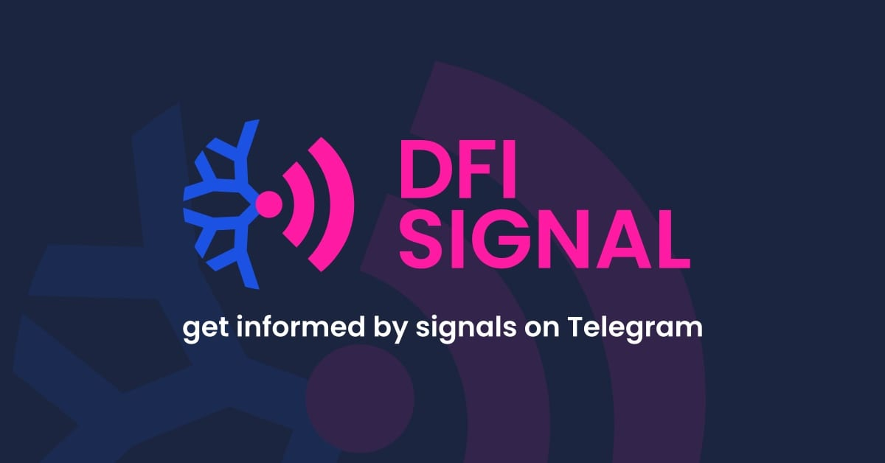

# DFI Signal

Get all information on [DFI-Signal.de](https://dfi-signal.de).

#Commands
*/sync* - sync masternodes stored in your Masternode Monitor backup

*/sync_key_changed* - update your Masternode Monitor Sync Key

*/sync_disable* - disabled the masternode sync

*/link_mn <OWNER_ADDRESS>* - links a masternode

*/unlink_mn <OWNER_ADDRESS>* - unlinks a masternode

*/list* - list your masternodes

*/stats* - statistics about your masternodes

*/reset* - remove all stored data and reset your DFI Signals

*/stop* - stops the current conversation with the bot

## DFI Signal Bot

Telegram Bot is available under [@DFI_Signal_bot](https://t.me/DFI_Signal_bot).
